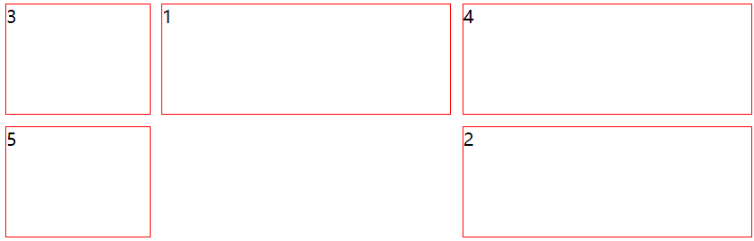

在 css 中实现页面布局的主要方法是设定 <span class="markdown-text-background-color">display</span>属性的值。
一些布局方式，便是从设置<span class="markdown-text-background-color">display</span>属性开始。**flex** 布局已经用很久了，记录下 **Grid**布局的用法。Grid布局是网格布局，它可以将页面划分为指定的行数与列数进行布局。  

<span class="markdown-text-background-color">grid-template-columns</span>属性用来指定网格的尺寸与大小。使用fr单位划分页面个数与尺寸，如将页面划分为3列，比例为1:2:1，则有
<span class="markdown-text-background-color">grid-template-columns:1fr 2fr 1fr</span>；另外也可以用px指定网格尺寸，例如用
<span class="markdown-text-background-color">grid-template-columns: 1fr 60px;</span>将页面划分为两列，其第二列固定为60px，第一列填满剩余空间。
<span class="markdown-text-background-color">grid-template-rows</span>用来定义网格行尺寸，<span class="markdown-text-background-color">grid-gap</span>定义网格之间的距离。  

<span class="markdown-text-background-color">grid-column</span>与<span class="markdown-text-background-color"> grid-row</span>用于定义子元素显示位置。其中<span class="markdown-text-background-color">grid-column</span>
可以设置为双值，此时需要用 / 分隔，前者为开始位置，后者为结束位置。其中第二个值可以设置为例如 **-1**、**span 2**，它们分别表示填满剩余与跨越格数。需要注意的是，此时结束格数、跨越格数尺寸为指定的最小网格尺寸。下面是一个例子；
```html
  <div class="grid-body">
    <div>1</div>
    <div>2</div>
    <div>3</div>
    <div>4</div>
    <div>5</div>
  </div>
```
```css
.grid-body{
  display: grid;
  grid-template-columns:1fr 2fr 2fr;  /*三列，尺寸比为1:2:2*/
  grid-template-rows: 100px 100px;  /*每行100px*/
  grid-gap: 10px;
  >div{
    border: 1px red solid;
  }
  >div:nth-child(1){
    grid-column: 2 / 3; 
    grid-row: 1;
  }
  >div:nth-child(2){
    grid-column: 3;
    grid-row: 2;
  }
}
```

显示结果为：

